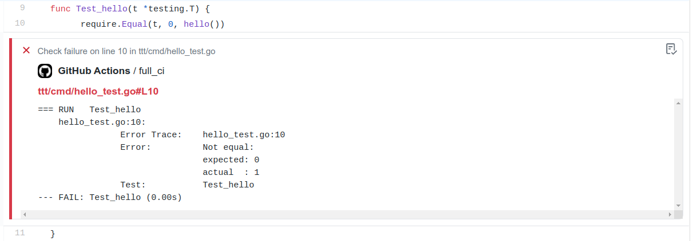

# golang-test-annotations
A github action which annotates failed tests.



An example run can be found [here](https://github.com/guyarb/golang-test-annotations-example/actions/runs/505258482)

## How to use

Add to your workflow the following contents:

```yaml
name: pr

on:
  pull_request:
    branches: [ '**' ]
  workflow_dispatch:
    branches: [ '**' ]

jobs:
  full_ci:
    strategy:
      matrix:
        go_version: [ 1.18.x ]

    runs-on: ubuntu-20.04

    steps:
      - name: checkout
        uses: actions/checkout@v2

      - name: Set up Go
        uses: actions/setup-go@v3
        with:
          go-version: ${{ matrix.go_version }}
        
      - name: run tests
        run: go test -json ./... > test.json

      - name: Annotate tests
        if: always()
        uses: guyarb/golang-test-annotations@v0.5.0
        with:
          test-results: test.json
          package-name: foobar # optional, if using custom package name, github.com/owner/repo stripped from the pathname by default
```

## Development of this action

1. Fork this repo.
2. Create a branch with your feature/bugfix.
3. Open a PR to me.

## Issues
Please open issues for any bug or suggestion you have.
